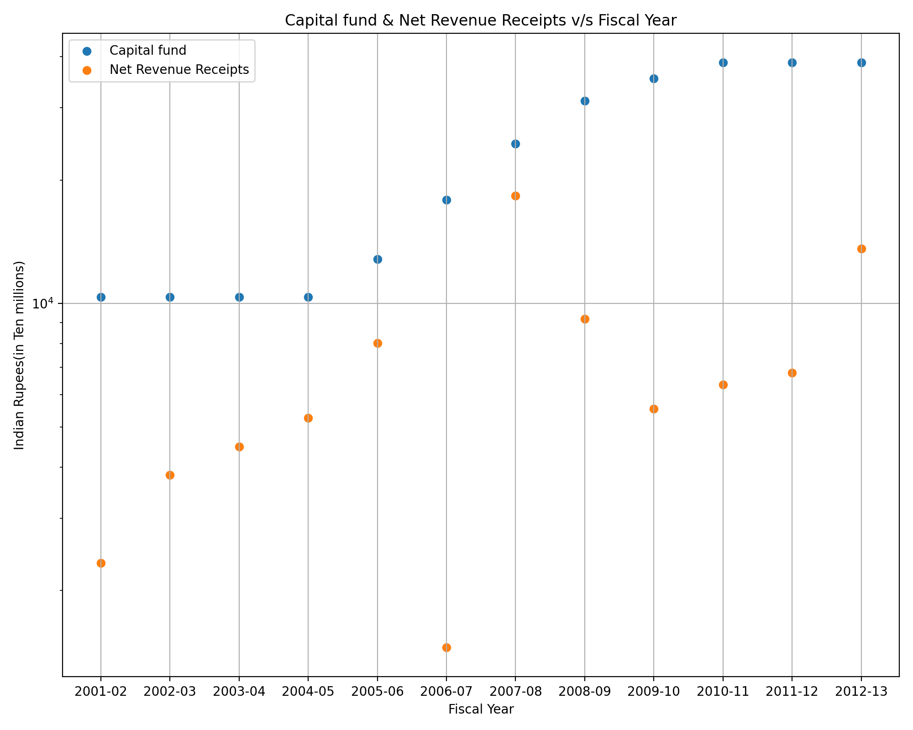
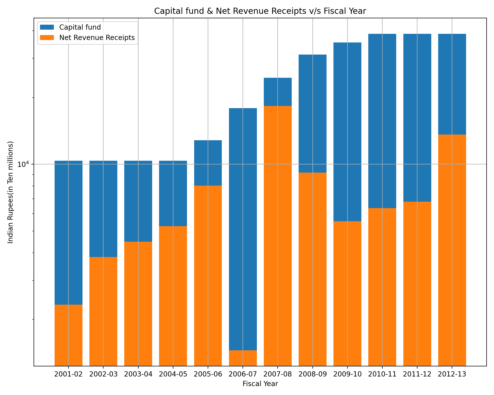
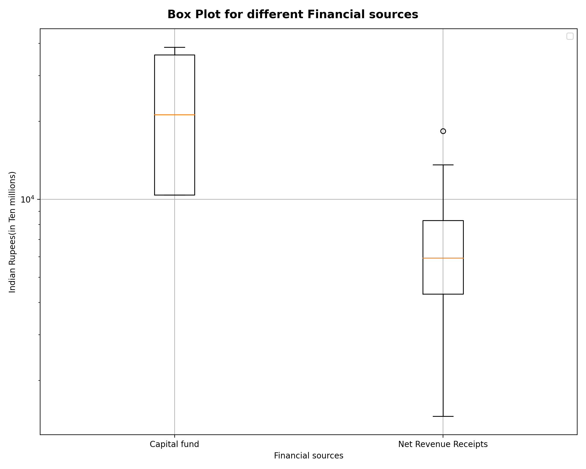

> **AIM:- To download a dataset from www.data.gov.in and do the following**
>> Make a scatterplot, Barchart and Boxplot and draw inferences from it using selected datasets.

### Part1: - Dataset
> The dataset is <a href="#my_anchor">[1]</a> **Financial Results Of Government Railways upto 2012-13** 
>> The link to download the dataset is https://data.gov.in/catalog/financial-results-government-railways .  The data is uploaded by **Ministry of Railways(Railway Board)** (https://indianrailways.gov.in/railwayboard/).  The data gives the statistics of the Total Capital-at-Charge,Capital fund, Gross Receipts, Net Traffic Receipts and Net Revenue Receipts and other statics over the years from 2001-2013.

### Files
> All the files are contained in the zip folder **DS200_Module4**
1.  **MRB_2013.csv** is the file containing all the data. The file is same as downloaded from website, only the names of states are shortened.
3.  **DS200_Module4_plots.ipynb** is the file containing Python code(Jupyter Notebook) for the creating the graphs using _matplotlib_ library.

### Part1: - Scatter Plot
> Scatter Plot.

>                     Figure(1): Capital fund & Net Revenue Receipts v/s Fiscal Year.

1. Scatter Plot in Figure(1), depicts distribution of Indian rupees (in Ten millions) scaled as **log** axis, from different Financial sources over thr course of Fiscal year.
2. Scatter Plot depicts exact points corresponding to given dataset hence it's easy to interprate values corresponding to required 

#### The observations can be derived from the Scatter chart :-
1.  From 2001-2005 **Capital fund** is almost constant while **Net Revenue Receipts** is increasing which clearly indicates that without much investment, Indian Railway is in profit.
2.  In Fiscal year 2006-07 **Capital fund** has increased but **Net Revenue Receipts** drastically that directly means Indian Railways has done heavy investement, which again reflects in next Fiscal years **Net Revenue Receipts**.
3.  Although after 2007-08  **Capital fund** has grown but **Net Revenue Receipts** is low as coampared to year 2007-08 but is almost constant for upcoming years.
* * *

### Part2: - Bar Chart
> Bar Plot

>                     Figure(2): Capital fund & Net Revenue Receipts v/s Fiscal Year.

1.  Bar Chart shows data as height, which makes visual interpration easy for getting insights or deriving further inference from it.

2. Just by visual inspection of Figure(2) we can make further inference about trends and also it enables visualisation of multiple data simultaneously.

#### The observations from the Bar Chart :-

1. **Capital fund** is increasing over the **Fiscal years** while **Net Revenue Receipts** has non unifrom distribution which can be just interprated in one sight.
2. Y-axis shows Capital(INR), scaled as **log** axis, which in very easy to interprate large value of data, projection of height of bar in Y-axis will give us the exact value corresponding to bar.

* * *
### Part3: - Box Plot

> Box Plots.

>              Figure(3): Box plot of Capital fund & Net Revenue Receipts with Capital(INR).

1.  Box Plot depicts distribution of data through their quartiles, It consist of **outliers** in both ends and **Quatrtile 1, Interquartile Range (Quatrtile 2), Quatrtile 1**, where  **Interquartile Range** contains **50%** of data distribution while **Quartile 1 and Quatrtile 2** shares **25%** of the data distribution each. 
2. Here Box Plots corresponding to **Capital fund** and **Net Revenue Receipts**, directly shows the distribution of Capital(INR) is higher near **Quartile 3** that signifies **Capital fund** has increased over the course of Fiscal Years while **Net Revenue Receipts** has decreased.
#### The observations from the Boxplot :-

1. **Capital fund** has increased over the course of **Fiscal years** with median is in **Quartile 3** which signifies that median Capital(INR) (Y-axis scaled as **log**) is close to amount of **Capital fund** over the last **Fiscal Years**.

2. **Net Revenue Receipts** has decreased over the course of **Fiscal years** with median is in near **Quartile 1** which signifies that median Net Revenue Receipts(INR) is close to amount of **Net Revenue Receipts** over the initial **Fiscal Years**, which also signies intead of huge Investment on Railways we are not getting enough **profit** and most profitable years is sadly near middle and starting of **Fiscal year** .

## References
<b id="my_anchor">[1].</b> Financial Results Of Government Railways upto 2012-13,Ministry of Railways(Railway Board) and also published in statistical year book 2015 by MOSPI., [https://data.gov.in/catalog/financial-results-government-railways](https://data.gov.in/catalog/financial-results-government-railways)